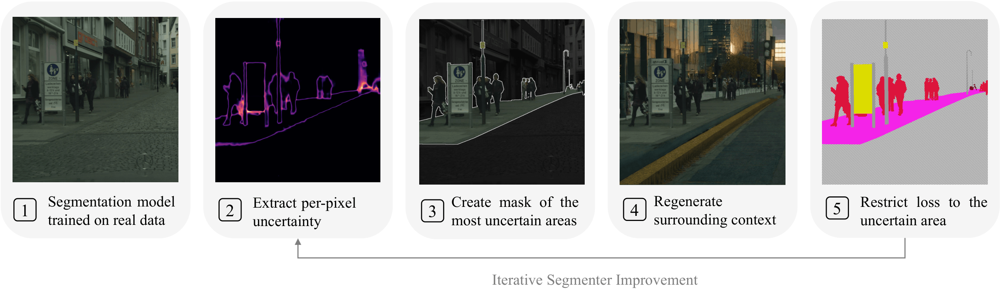

# Preserve the Hard, Regenerate the Rest
 
Official implementation of **"Preserve the Hard, Regenerate the Rest"** —
uncertainty-guided diffusion augmentation for semantic segmentation.
 


We train a segmentation model on real images, measure predictive entropy,
aggregate uncertainty over each ground-truth class, and preserve the most
uncertain classes until their union exceeds an area budget `τ`. An off-the-shelf
inpainter regenerates the complement; preserved pixels are pasted back from the
source, and every generated pixel—including the feathered boundary—is assigned
the dataset ignore index. The segmenter is then fine-tuned on real and synthetic
images without supervising regenerated content.
 
Implementation-level details live in
[`guided_generation/PIPELINE.md`](guided_generation/PIPELINE.md); the config
schema and dataset interface are in [`CONFIGURATION.md`](CONFIGURATION.md) and
[`DATASET_CONTRACT.md`](DATASET_CONTRACT.md).
 
## Repository structure
 
```text
.
├── configs/                    # Paper-matching Cityscapes/BDD100K/UAVID YAML
├── guided_generation/
│   ├── datasets/               # Dataset adapters for selection/generation
│   ├── diffusion/              # Inpainting pipelines and paste-back logic
│   ├── guidance/               # DINOv2 guide and optional diffusion guidance
│   ├── main_scripts/           # Step 1–4 entry points and local runner
│   └── sample_selection/       # Entropy-based preserve-mask selection
├── vfm4ss/                     # Segmenter, data modules, training, evaluation
├── SLURM/                      # Config-driven scheduler path
├── dataset_configs.py          # Classes, palettes, suffixes, ignore indices
├── environment.yml             # Supported conda environment
└── requirements.txt            # Fully pinned Python dependencies
```
 
## Installation
 
Supported path: conda on a single-GPU Linux machine. Training and generation use
CUDA 11.8 PyTorch wheels, so the installed NVIDIA driver must be compatible with
CUDA 11.8.
 
```bash
git clone <REPOSITORY_URL>
cd preserve_the_hard
 
conda env create -f environment.yml
conda activate preserve-the-hard
export PYTHONPATH="$PWD"
 
python -c "import torch; print(torch.__version__, torch.cuda.is_available())"
```
 
The first run downloads the configured backbone and the paper inpainter
([`diffusers/stable-diffusion-xl-1.0-inpainting-0.1`](https://huggingface.co/diffusers/stable-diffusion-xl-1.0-inpainting-0.1)).
Optionally relocate caches and pass credentials through the environment only
(never commit them):
 
```bash
export HF_HOME=/path/to/huggingface-cache
export TORCH_HOME=/path/to/torch-cache
export HF_TOKEN=<your-token>
export WANDB_API_KEY=<your-key>
```
 
W&B defaults to offline mode in the supplied Slurm scripts. Docker is optional;
see [`docker/README.md`](docker/README.md).
 
## Data preparation
 
Datasets are not redistributed—download each from its official source and comply
with its license.
 
**Cityscapes.** Register at the
[download page](https://www.cityscapes-dataset.com/downloads/), then extract
`leftImg8bit_trainvaltest.zip` and `gtFine_trainvaltest.zip` into
`data/cityscapes` (`leftImg8bit/{train,val}` and `gtFine/{train,val}`). The paper
config uses the fixed 10% subset: 297 training images and the full 500-image
validation split.
 
**BDD100K.** Download the three 10K image splits and the semantic-segmentation
labels, then normalize:
 
```bash
mkdir -p data/bdd100k/_unpack
cd data/bdd100k/_unpack
 
curl -LO https://dl.cv.ethz.ch/bdd100k/data/10k_images_train.zip
curl -LO https://dl.cv.ethz.ch/bdd100k/data/10k_images_val.zip
curl -LO https://dl.cv.ethz.ch/bdd100k/data/10k_images_test.zip
curl -LO https://dl.cv.ethz.ch/bdd100k/data/bdd100k_sem_seg_labels_trainval.zip
 
unzip '*.zip'
 
cd ../../..
python -m guided_generation.main_scripts.prepare_bdd100k_semseg \
  --unpack-root data/bdd100k/_unpack \
  --output-root data/bdd100k
```
 
This yields `data/bdd100k/images/10k/{train,val,test}` and
`labels/sem_seg/masks/{train,val}`. The paper config uses 10% of the 7,000
training images (700) and all 1,000 validation images. Archives and checksums:
[BDD100K index](https://dl.cv.ethz.ch/bdd100k/data/),
[docs](https://doc.bdd100k.com).
 
**UAVID.** Download the images-and-labels package from
[uavid.nl](https://uavid.nl/) and extract so the official sequence layout is
rooted at `data/uavid_official` (`uavid_{train,val}/<sequence>/{Images,Labels}`).
Convert RGB labels to train IDs and reproduce the paper crop (one deterministic
2048×2048 crop per frame, seed 44, resized to 1024×1024):
 
```bash
python -m guided_generation.main_scripts.prepare_uavid_semseg \
  --input-root data/uavid_official \
  --output-root data/uavid \
  --splits train val
 
python -m guided_generation.main_scripts.preprocess_uavid_scale_crops \
  --input-root data/uavid \
  --output-root temp/uavid_2048to1024 \
  --splits train val \
  --crop-size 2048 \
  --output-size 1024 \
  --crop-policy random-one \
  --label-resize nearest \
  --seed 44
```
 
This retains the paper's 200 training and 70 validation images under
`temp/uavid_2048to1024/{img_dir,ann_dir}`.
 
## Quickstart
 
The smoke profile (two samples, two optimizer/denoising steps, one seed, batch
size 1) verifies wiring only—it is not a meaningful experiment:
 
```bash
conda activate preserve-the-hard
export PYTHONPATH="$PWD"
export WANDB_MODE=disabled
 
python -m guided_generation.config --config configs/cityscapes.yaml --format validate
python -m guided_generation.main_scripts.run_pipeline --config configs/cityscapes.yaml --smoke
```
 
Add `--dry-run` to preview the exact commands without training or downloading
models.
 
## Full pipeline
 
Pick one config: `configs/cityscapes.yaml`, `configs/bdd100k.yaml`, or
`configs/uavid.yaml`.
 
**Local, one command:**
 
```bash
python -m guided_generation.main_scripts.run_pipeline --config "$CONFIG"
```
 
This runs four stages sequentially. To run them individually, pass `--stages N`.
Stages 2–4 require the Step 1 checkpoint:
 
```bash
# Step 1 — train the real-only baseline
python -m guided_generation.main_scripts.run_pipeline --config "$CONFIG" --stages 1
 
# Resolve the newest checkpoint (adjust the search root per config)
CKPT="$(
  find training_logs/cityscapes/real_only -type f -name '*.ckpt' -printf '%T@ %p\n' |
  sort -nr | head -n 1 | cut -d' ' -f2-
)"
test -n "$CKPT"
 
# Step 2 — uncertainty preserve masks · Step 3 — inpaint complement · Step 4 — fine-tune
python -m guided_generation.main_scripts.run_pipeline --config "$CONFIG" --stages 2 --checkpoint "$CKPT"
python -m guided_generation.main_scripts.run_pipeline --config "$CONFIG" --stages 3 --checkpoint "$CKPT"
python -m guided_generation.main_scripts.run_pipeline --config "$CONFIG" --stages 4 --checkpoint "$CKPT"
```
 
Step 4 runs every seed in `training.fine_tune_seeds`.
 
**Slurm, one command** (scripts request one GPU via `#SBATCH --gres=gpu:1`;
adapt if your cluster differs). The orchestrator submits four `afterok`-chained
jobs, each using `conda run -n preserve-the-hard`:
 
```bash
conda activate preserve-the-hard
export PYTHONPATH="$PWD"
 
./SLURM/run_pipeline.sh "$CONFIG"          # add DRY_RUN=1 to preview without sbatch
```
 
## Key configuration options
 
The YAML files are the single source of truth for local and Slurm runs.
 
- **`selection.tau`** — per image, classes are ranked by decreasing mean
  predictive entropy and added whole until their union strictly exceeds
  `tau × H × W` (final area can exceed `tau` when the last class is large).
  Paper iteration-1 values: Cityscapes `0.10`, BDD100K `0.10`, UAVID `0.15`.
- **Synthetic-to-real ratio** — real and synthetic sets are concatenated, so the
  ratio follows their sample counts and the `real_split` / `synthetic_split`
  fractions. The supplied configs generate one synthetic image per retained real
  image and use all of both, giving the paper's 1:1 ratio.
- **Backbone** — `model.encoder_name` is passed unchanged to Step 1, entropy
  scoring, and Step 4. Paper: `vit_small_patch14_dinov2`.
- **Inpainter** — plain SDXL inpainting, no ControlNet or classifier guidance:
```yaml
  generation:
    inpainter: sdxl_inpainting
    model_id: diffusers/stable-diffusion-xl-1.0-inpainting-0.1
    context_guidance_strength: 0.0
    num_steps: 40
    cfg_guidance_scale: 7.0
    mask_erosion_kernel: 0
```
- **Seeds** — the labeled subset is fixed with seed 44 independently of training
  seeds; changing a training seed affects init, data order, and augmentation
  randomness, but not which labeled images are available.
## Iterative refinement
 
For a later round, copy the dataset YAML, point `paths.cache`,
`paths.synthetic`, and `paths.step4_logs` at new round-specific locations, set
`model.checkpoint` to the previous round's best checkpoint, and run Steps 2–4:
 
```bash
python -m guided_generation.main_scripts.run_pipeline \
  --config configs/cityscapes_iteration2.yaml --stages 2,3,4
```
 
Each round builds a fresh synthetic set from the same fixed real IDs; earlier
synthetic sets are not concatenated.
 
## Custom datasets, models, and inpainters
 
To add a dataset, follow [`DATASET_CONTRACT.md`](DATASET_CONTRACT.md): provide
paired RGB images and integer masks, define metadata in `dataset_configs.py`,
register an adapter in `guided_generation/datasets/registry.py` and data modules
in `vfm4ss/segmentation_trainer.py`, then copy a YAML. Explicit registration
prevents silent class-ID or ignore-index mistakes.
 
Swap the backbone via any compatible `timm` encoder (`model.encoder_name`,
`checkpoint: auto`); the checkpoint architecture must match when resuming.
Supported inpainting backends—`sdxl_inpainting`, `sdxl_diffusers_inpainting`,
`sd15_diffusers_inpainting`, `flux_fill`, `sdxl_controlnet_inpainting`—are
selected with `generation.inpainter` / `generation.model_id`. Native Diffusers
and FLUX backends require `context_guidance_strength: 0.0`; FLUX additionally
needs an authorized `HF_TOKEN` after accepting the
[model terms](https://huggingface.co/black-forest-labs/FLUX.1-Fill-dev). These
optional backends are not part of the paper's main experiments.
 
## Outputs
 
For the Cityscapes config:
 
```text
training_logs/cityscapes/real_only/.../checkpoints/*.ckpt   # Step 1 baseline
.cached_images4gen/cityscapes/iteration1/                   # source crops, labels, masks, metadata
synthetic_data/cityscapes/iteration1/                       # augmented RGB + ignore-labeled annotations
training_logs/cityscapes/iteration1/                        # Step 4 checkpoints + metrics_seed_*.json
```
 
Slurm Step 4 also writes per-run metrics under
`training_logs/step4_multirun_<job-id>/`. Synthetic images are written
losslessly, so JPEG-source datasets (e.g. BDD100K) receive PNG synthetic images;
Step 4 reads the recorded suffix from `pipeline_metadata.json`.
 
## Reproducibility notes
 
- Fixed subset seed: 44.
- Cityscapes/BDD100K cache: joint random 1024×1024 crop and horizontal flip.
- UAVID: deterministic 2048×2048 crop resized to 1024×1024.
- SDXL generation: 40 DDIM steps, CFG 7.0, strength 0.9999, seed `42 + i`.
- Paste-back: Gaussian alpha mask with σ=1.5; no erosion.
- Generated and feathered pixels are ignored during synthetic supervision.
- Validation uses the complete real validation split.
 
## License
 
MIT License. 
Cityscapes, BDD100K, UAVID, DINOv2, SDXL, and optional model backends remain governed by their own licenses.
 
## Acknowledgments
 
Built on PyTorch, Lightning, timm, DINOv2, Hugging Face Diffusers, SDXL, and the
Cityscapes, BDD100K, and UAVID datasets. Please cite and follow the license
terms of every dataset and pretrained model used.
 
